# MicroLanding Architecture

This document is the living map for the micro-landing codebase.
Update it whenever structure, dependencies, or behavior changes.

## System Diagram

```mermaid
graph TD
  A[small site.html] --> B[styles/main.css]
  A --> C[translations.js]
  A --> D[js/theme.js]
  A --> E[js/lang.js]
  A --> F[js/modal.js]
  A --> G[js/animations.js]
  A --> H[js/app.js]
  A --> IMG[images/logoADLA.JPG + LogoV3.png]

  C --> E

  D --> I[data-theme on html element]
  D --> L[localStorage adla-theme]
  D --> OS[OS prefers-color-scheme listener]

  E --> J[data-i18n / data-i18n-html / data-i18n-attr bindings]
  E --> K[localStorage adla-lang]
  E --> LANG[html lang attribute]
  E --> FALLBACK[fallback to es locale]

  F --> M[#modalOverlay #modalContent]
  F --> N[openModal / closeModal public API]
  F --> SCROLL[body scroll lock and unlock]
  F --> IOS[iOS Safari touchmove prevention]

  A -->|data-modal attribute| F

  B --> O[design tokens light and dark]
  B --> P[responsive breakpoints 900 600 380px]
  B --> Q[modal overlay frosted glass and slideIn animation]
  B --> LOGO[logo blend filter and vignette mask]
  B --> BTNFIX[hero button flex equalization]
  B --> CTAFIX[navbar CTA nowrap and flex-shrink]
  B --> FOOTER[footer-identity absolute logo layout]

  G --> R[navbar scrolled class on scroll]
  G --> S[agenda IntersectionObserver staggered reveal]
  G --> PM[global prefersReducedMotion const]

  H --> T[smooth anchor scrolling]
  H --> U[mobile menu toggle open close Escape outside-click resize]
```

## File Responsibilities

- **small site.html**: Main HTML structure, five semantic sections (navbar, hero, about, event, agenda), footer, modal container, and script loading order. All asset paths use `?v=20260529` cache-bust params. Navbar uses two real logo images instead of an inline SVG. Footer uses `.footer-identity` wrapper. The value chip with `data-modal="impacto-demo"` triggers `openModal()` from modal.js. Several strings are hard-coded and exempt from i18n (see Known Constraints).

- **styles/main.css**: Complete visual system. Key sections:
  - *Design tokens*: `:root` and `[data-theme="dark"]` custom property sets; uses `color-mix()` throughout (requires modern browsers).
  - *Navbar*: sticky frosted-glass bar; `.brand-logo` / `.brand-logo-adla` / `.brand-logo-v3` with vignette mask and blend filter; `.btn-cta-sm` with `white-space: nowrap` and `flex-shrink: 0`.
  - *Hero*: radial-gradient blobs, two-column layout collapsing at 900px; `.hero-actions` with `flex: 1` on both buttons so they are always equal width per language; `.btn-primary` uses `border: 2px solid transparent` to match `.btn-ghost` box model.
  - *About*: mosaic grid, floating badge, values grid with `data-modal` cursor/focus styles.
  - *Event*: card with decorative pseudo-element, metadata row, date block.
  - *Agenda*: vertical timeline line, grid items with dot markers, per-tag color classes (`tag-keynote`, `tag-workshop`, `tag-break`, `tag-field`, `tag-social`).
  - *Footer*: `.footer-identity` uses `position: relative` + `padding-left` so the absolutely-positioned `.footer-logo` (110px desktop / 84px mobile) does not stretch the footer height.
  - *Modal*: frosted-glass overlay (`backdrop-filter`), `slideIn` keyframe, `modal-open` body class (set by modal.js), close button with rotate hover.
  - *Responsive*: three breakpoints — 900px (single-column layouts), 600px (mobile nav, hidden hero visual, stacked agenda), 380px (hidden brand text, smaller controls).

- **translations.js**: Locale dictionaries for `es`, `en`, `fr`. Exposes `window.ADLA_TRANSLATIONS`. Agenda items use per-row `agendaSpeaker1–9` and `agendaItem1–9Title/Detail` keys. `navCta` is short in all three locales for navbar fit. `heroSubtitle` uses "Residencial La Antigua" in all locales.

- **js/theme.js**: Reads `localStorage adla-theme` → falls back to `prefers-color-scheme` → defaults to `light`. Sets `data-theme` on `<html>`. Toggles on button click and listens for OS color-scheme changes (only applied when no saved preference exists).

- **js/lang.js**: Reads `window.ADLA_TRANSLATIONS`. Applies translations via three HTML attribute bindings: `data-i18n` (textContent), `data-i18n-html` (innerHTML), `data-i18n-attr` (arbitrary attributes, semicolon-separated `attr:key` pairs). Falls back to `es` for any missing key. Updates `document.documentElement.lang` for accessibility. Persists selection in `localStorage adla-lang`.

- **js/modal.js**: Public API: `openModal({ title, body })` / `closeModal()`. Dynamically builds modal DOM on each open call. Locks body scroll by fixing `document.body` position (preserves scroll offset on unlock). Prevents iOS Safari page drag on backdrop touchmove. Closes on: overlay click, Escape key, close button click.

- **js/animations.js**: Declares global `const prefersReducedMotion`. Adds `.scrolled` class to `#navbar` when `scrollY > 20` (passive scroll listener). Initialises `IntersectionObserver` for `.agenda-item` elements — staggered `opacity`/`translateX` reveal with `0.07s` per-item delay. Respects reduced-motion by skipping animations entirely.

- **js/app.js**: Declares `const prefersReducedMotionApp` (distinct from animations.js global). Wires mobile menu toggle: click to open/close, Escape key close, outside-click close, resize-to-desktop reset. Enables smooth `scrollIntoView` for all `a[href^="#"]` links.

- **images/logoADLA.JPG**: Primary organization logo. Used in navbar (`.brand-logo-adla`, 68px / 60px mobile) and footer (`.footer-logo`, 110px / 84px mobile). Both instances use vignette mask + saturation/contrast filter.

- **images/LogoV3.png**: Secondary logo. Used in navbar only (`.brand-logo-v3`, 60px / 52px mobile). Same vignette/blend treatment as logoADLA.

## Runtime Flow

1. `small site.html` loads `styles/main.css?v=20260529` and all JS files in declaration order.
2. `translations.js` synchronously exposes `window.ADLA_TRANSLATIONS`.
3. `theme.js` reads localStorage / OS preference and sets `data-theme` on `<html>`, then binds toggle button.
4. `lang.js` reads `ADLA_TRANSLATIONS`, applies saved/default locale to all `data-i18n*` elements, and binds the language dropdown.
5. `modal.js` binds overlay click and Escape key; exposes `openModal` / `closeModal` globals for use by inline `data-modal` triggers (wired in app.js or directly via `data-modal` attribute).
6. `animations.js` attaches passive scroll listener for navbar shadow and sets up IntersectionObserver for agenda reveals.
7. `app.js` wires mobile hamburger menu and smooth-scroll for all in-page anchors.

## Known Constraints

- **Global const collision**: `prefersReducedMotion` is a top-level `const` in `animations.js`. `app.js` must use `prefersReducedMotionApp` to avoid a duplicate-declaration runtime error that would silently prevent the mobile menu from working.
- **Hard-coded strings** (not overwritten by language switching): hero eyebrow (`🌿 Residencial la Antigua`), footer tagline (`Residencial La Antigua, Tres Ríos...`), and `heroCardSub`. These have no `data-i18n` attribute by design.
- **Removed translation keys**: `agendaTagRegistration`, `agendaTagOpening`, `agendaTagWorkshop`, `agendaTagPlanting`, `agendaTagBreak`, `agendaTagClosing` are gone. All agenda speaker/tag slots now use `agendaSpeaker1–9`.
- **`color-mix()` usage**: `styles/main.css` uses `color-mix(in srgb, …)` throughout. This requires Chrome 111+, Firefox 113+, Safari 16.2+. Older browsers will fall back to the fallback color or transparent.
- **Modal DOM**: `openModal()` clears `#modalContent` innerHTML and rebuilds it on every call. Any event listeners attached directly to modal children outside of `modal.js` will be lost on re-open.

## Update Rules

Keep this file current whenever any of the following changes:

- A file is added, removed, or renamed in MicroLanding.
- Script load order changes in `small site.html`.
- A module starts depending on a new module or global.
- A new shared state key is introduced in `localStorage`.
- A new cross-cutting feature is added (e.g. analytics, forms, API calls, auth).
- A string is moved from i18n to hard-coded HTML, or vice versa.
- A browser-compat constraint is introduced or resolved.

When updating, always do both:

1. Update the Mermaid graph edge or node.
2. Update the matching bullet in File Responsibilities, Runtime Flow, or Known Constraints.

## Last Updated

- 2026-05-26: Initial architecture map created.
- 2026-05-29: Added `images/` (logoADLA.JPG, LogoV3.png); replaced navbar SVG placeholder with logo images; added per-row agenda speaker keys; fixed `prefersReducedMotion` global collision in app.js; cache-bust params added to all assets.
- 2026-05-30: Footer identity layout (absolute-positioned large logo beside brand text); logo vignette/blend CSS treatment for navbar and footer logos; hero button flex equalization (`flex: 1`, matching transparent border); navbar CTA `nowrap`/`flex-shrink` fix; hard-coded hero eyebrow and footer tagline; `heroSubtitle` updated to Residencial La Antigua in all locales; full deep-review of all js/ and styles/ files.
