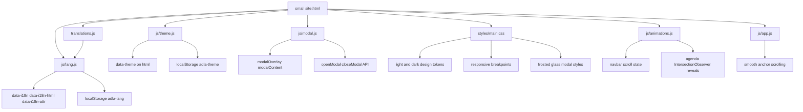

# MicroLanding Architecture

This document is the living map for the micro-landing codebase.
Update it whenever structure, dependencies, or behavior changes.

## System Diagram

## File Responsibilities

- small site.html: Main HTML structure, semantic sections, modal container, and script loading order.
- styles/main.css: Core visual system, theme variables, layout, responsive rules, animations, language dropdown styling, and modal visuals.
- translations.js: Locale dictionaries for es, en, fr. Source of translatable UI text and ARIA labels.
- js/theme.js: Theme initialization, toggle behavior, persistence with adla-theme, and OS preference fallback.
- js/lang.js: Translation application engine and custom language dropdown behavior with persistence in adla-lang.
- js/modal.js: Reusable modal behavior and close triggers (overlay click, Escape key, close button).
- js/animations.js: Scroll-triggered navbar state and agenda reveal animation logic.
- js/app.js: Global smooth-scroll handling for in-page anchors.

## Runtime Flow

1. small site.html loads styles/main.css and all JS files in order.
2. translations.js exposes ADLA_TRANSLATIONS on window.
3. theme.js applies initial theme and toggle behavior.
4. lang.js applies selected locale and binds language dropdown interactions.
5. modal.js wires reusable popup behavior.
6. animations.js attaches scroll and IntersectionObserver effects.
7. app.js enables smooth scrolling for hash links.

## Update Rules

Keep this file current whenever any of the following changes:

- A file is added, removed, or renamed in MicroLanding.
- Script load order changes in small site.html.
- A module starts depending on a new module or global.
- A new shared state key is introduced in localStorage.
- A new cross-cutting feature is added (for example analytics, forms, API calls, auth).

When updating, always do both:

1. Update the Mermaid graph edge or node.
2. Update the matching bullet in File Responsibilities or Runtime Flow.

## Last Updated

- 2026-05-26: Initial architecture map created.
