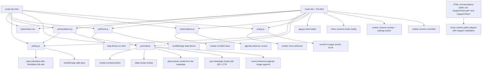

# LandingPage Architecture

This document is the living architecture map for the `Website/LandingPage` workspace.
Update it whenever structure, dependencies, runtime behavior, or tracking/privacy behavior changes.

## System Diagram

## Directory Snapshot

- `small site.html`: Main landing page (no analytics consent layer).
- `small site + GA.html`: Landing page variant with GA4 + consent-mode + cookie consent UI.
- `js/translations.js`: `window.ADLA_TRANSLATIONS` dictionaries (`es`, `en`, `fr`).
- `translations_backup_corrupted.js`: Historical backup, not loaded by either HTML entrypoint.
- `styles/main.css`: Global visual system and responsive behavior.
- `js/theme.js`: Theme persistence + toggle.
- `js/lang.js`: i18n binding + language picker behavior.
- `js/modal.js`: Modal system and all `data-modal` routes.
- `js/animations.js`: Navbar scroll style + agenda reveal animation.
- `js/app.js`: Mobile nav behavior + smooth anchor scrolling.
- `agenda.txt`: Agenda source notes/reference.
- `test-translations.html`: Manual translation testing page.
- `Support/General/`: shared site assets (`Agenda.jpeg`, `Info.jpg`, `logoADLA.JPG`, `qrWA.jpg`, `Hero.jpg`, audio, and related media).
- `Support/Tiles/`: photo tile library for About section imagery.

## Entry Points

- `small site.html`
  - Loads the shared CSS and JS stack in this order:
    1. `js/translations.js`
    2. `js/theme.js`
    3. `js/lang.js`
    4. `js/modal.js`
    5. `js/animations.js`
    6. `js/app.js`

- `small site + GA.html`
  - Loads the same stack as `small site.html`.
  - Adds inline CSS and JS for consent UI.
  - Adds GA4 script and consent-mode defaults before runtime scripts.

## Core Runtime Behavior

1. `js/translations.js` defines `window.ADLA_TRANSLATIONS`.
2. `theme.js` resolves `adla-theme` from localStorage (or OS preference fallback) and writes `data-theme`.
3. `lang.js` applies locale text/HTML/attribute translations and persists `adla-lang`.
4. `modal.js` handles all `data-modal` triggers, builds modal DOM dynamically, and locks scroll safely.
5. `animations.js` applies navbar scroll state and reveals agenda items with intersection observer.
6. `app.js` controls mobile nav open/close and smooth in-page anchor navigation.

## About Section Architecture

- Left column uses a 3-tile mosaic layout.
- Each tile is a button with `data-modal="about-photo"` and metadata:
  - `data-photo-src`
  - `data-photo-title-key`
  - `data-photo-alt-key`
- `modal.js` resolves localized title/alt from `js/translations.js` and opens an enlarged image modal.
- Current tile sources are external placeholder URLs (text-labeled placeholders).
- About badge year is intentionally placeholder text: `XXXX`.

## Modal Routes (data-modal)

Current routed modal IDs in `js/modal.js`:

- `about-photo`
- `join-whatsapp`
- `chip-temp`
- `chip-landscape`
- `chip-wildlife`
- `chip-climate`
- `chip-cohesion`
- `chip-security`
- `event-info`
- `event-agenda`

Behavior highlights:

- `join-whatsapp`: localized title/body + QR image + CTA link.
- `chip-security`: optional translatable video CTA when URL exists.
- `event-info` and `event-agenda`: append translatable image when URL exists.
- All modal content is rebuilt every open; direct listeners on inner modal nodes are not persistent.

## Analytics and Consent (`small site + GA.html` only)

- GA4 script present with placeholder Measurement ID: `G-XXXXXXXXXX`.
- Consent-mode default is privacy-first denied:
  - `analytics_storage: denied`
  - `ad_storage: denied`
  - `ad_user_data: denied`
  - `ad_personalization: denied`
- Minimal tracking settings configured:
  - `anonymize_ip: true`
  - `allow_google_signals: false`
  - `allow_ad_personalization_signals: false`
  - `send_page_view: false` until consent accepted
- Cookie consent overlay appears when no saved choice exists.
- Choice persisted in `localStorage` key `adla_cookie_consent_v1` with values:
  - `accepted`
  - `rejected`
- A persistent "Privacidad y cookies" button reopens consent settings.

## i18n Coverage Notes

- Locale dictionaries are complete across `es`, `en`, `fr` for active UI keys, including:
  - Join-chat modal copy/URLs
  - About extra sections (`aboutOrg*`, `aboutMunicipal*`)
  - About photo modal labels (`aboutPhoto*`)
  - Event and agenda keys
- Agenda speaker keys `agendaSpeaker7` and `agendaSpeaker8` are comma-separated lists.

## Known Constraints and Risks

- Asset path coordination risk:
  - Active HTML and translation values must stay aligned with `Support/General/...` and `Support/Tiles/...` paths.
  - If assets are reorganized again, stale paths can break logos/QR/event media.

- Placeholder dependencies:
  - About tile images currently use external placeholder URLs.
  - Production should replace with final project-controlled media URLs.

- Measurement ID placeholder:
  - `small site + GA.html` will not report analytics until `G-XXXXXXXXXX` is replaced.

- Duplicate variant maintenance:
  - `small site.html` and `small site + GA.html` can diverge if edits are not applied to both when intended.

## Non-Production/Reference Files

- `translations_backup_corrupted.js`: historical backup, excluded from runtime.
- `test-translations.html`: QA utility page, not part of main runtime path.
- `agenda.txt`: source notes; no direct runtime dependency.
- `Extras/Infra-doc.md`, `Extras/TS-guide.md`: documentation/reference assets.

## Update Checklist

When behavior changes, update this file and include:

1. Diagram node/edge changes.
2. Updated file responsibilities.
3. Updated runtime flow if load order or state changes.
4. New/changed localStorage keys.
5. New modal IDs or translation key groups.
6. New privacy/analytics behavior details.

## Last Updated

- 2026-05-31: Full refresh after About photo-tile modal integration, translations expansion, comma-separated agenda speaker updates, `small site + GA.html` creation, GA4 consent-mode defaults, mandatory cookie consent popup, and privacy-settings reopen control.
