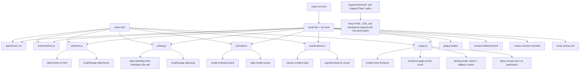

# LandingPage Architecture

This document is the living architecture map for the `Website/LandingPage` workspace.
Update it whenever structure, dependencies, runtime behavior, accessibility, or privacy behavior changes.

## System Diagram

## Directory Snapshot

- `index.html`: primary self-contained landing page
- `index-GA.html`: redirect bootstrap entrypoint to `small site + GA.html`.
- `index-redirect.html`: archived redirect bootstrap (former `index.html` behavior); not part of the production path.
- `small site + GA.html`: landing variant with GA4 consent-mode and privacy UI.
- `styles/main.css`: shared visual system, component styling, and responsive layout.
- `js/translations.js`: `window.ADLA_TRANSLATIONS` dictionaries (`es`, `en`, `fr`).
- `js/theme.js`: theme persistence and toggle behavior (`data-theme`, `adla-theme`).
- `js/lang.js`: i18n binding and language picker behavior (`adla-lang`).
- `js/modal.js`: modal runtime and `data-modal` route handling.
- `js/animations.js`: navbar scroll-state behavior and agenda reveal animation.
- `js/app.js`: mobile nav, smooth anchors, landing audio handling, and about mosaic sync logic.
- `Support/General/`: shared assets (logos, hero image, QR, info/agenda media, icons, audio).
- `Support/Tiles/`: local photo tile set used by the About mosaic.
- `translations_backup_corrupted.js`, `test-translations.html`, `agenda.txt`: reference/QA artifacts not loaded by production entrypoints.

## Entry Points and Load Order

- `index.html`
  - Landing page; loads the full shared stack directly:
    1. `js/translations.js`
    2. `js/theme.js`
    3. `js/lang.js`
    4. `js/modal.js`
    5. `js/animations.js`
    6. `js/app.js`

- `index-GA.html`
  - Redirect bootstrap to `small site + GA.html`.
  - Provides explicit GA-enabled index route.

- `index-redirect.html`
  - Archived redirect bootstrap (former `index.html`); kept for reference.
  - Not linked from any production path.

- `small site + GA.html`
  - Loads the same shared stack.
  - Adds inline consent UI styles and inline consent controller script.
  - Loads GA4 and sets consent-mode defaults before runtime modules.

## Core Runtime Behavior

1. `js/translations.js` defines locale dictionaries and content keys.
2. `js/theme.js` resolves persisted theme (or OS preference fallback), then writes `data-theme`.
3. `js/lang.js` applies translated text/HTML/attributes and persists selected language.
4. `js/modal.js` builds modal DOM dynamically for each open and handles all modal routes.
5. `js/animations.js` applies navbar scrolled state and agenda-item reveal animations.
6. `js/app.js` handles mobile menu, smooth anchor scroll, landing audio replay UX, and about mosaic synchronization.

## About Section Architecture

- About visual uses a local tile mosaic driven by `Support/Tiles/*.jpg` assets.
- Each photo tile uses `data-modal="about-photo"` plus metadata:
  - `data-photo-src`
  - `data-photo-title-key`
  - `data-photo-alt-key`
- `modal.js` resolves localized title/alt and opens image lightbox modal.
- Mosaic includes `tile-16.jpg` and an in-grid floating badge tile (`Fundados 2024`).
- Mobile layout uses compact multi-column mosaic behavior rather than stacked single-column placeholders.

## Modal Routes (`data-modal`)

Current routed modal IDs in `js/modal.js`:

- `about-photo`
- `join-whatsapp`
- `chip-temp`
- `chip-landscape`
- `chip-wildlife`
- `chip-climate`
- `chip-cohesion`
- `chip-security`
- `event-info`
- `event-agenda`

Behavior highlights:

- `join-whatsapp`: localized body + QR + CTA.
- `chip-security`: optional translated video embed/CTA handling.
- `event-info` and `event-agenda`: append translated image assets when URLs are present.
- Modal content is rebuilt each open; ephemeral listeners are reattached on each render.

## Analytics and Consent (`small site + GA.html` only)

- GA4 script present with placeholder Measurement ID `G-XXXXXXXXXX`.
- Consent defaults are privacy-first denied:
  - `analytics_storage: denied`
  - `ad_storage: denied`
  - `ad_user_data: denied`
  - `ad_personalization: denied`
- Minimal analytics settings:
  - `anonymize_ip: true`
  - `allow_google_signals: false`
  - `allow_ad_personalization_signals: false`
  - `send_page_view: false` until consent is accepted
- Consent is stored in `localStorage` key `adla_cookie_consent_v1` as JSON:
  - `{ value: 'accepted' | 'rejected', updatedAt: <epoch-ms> }`
- Consent expiry policy is 180 days (`CONSENT_MAX_AGE_DAYS = 180`).
- Expired or legacy string-only records are treated as stale and re-prompt users.
- Privacy modal displays a "Ultima actualizacion del consentimiento" timestamp line.
- A compact footer "Privacidad y cookies" pill reopens the consent modal.

## i18n Coverage Notes

- Locale dictionaries (`es`, `en`, `fr`) cover active keys, including:
  - Updated nav/event keying (`navTreeDay2026`)
  - Event "learn more" CTA keys (`eventLearnMoreCta`, `eventLearnMoreAria`)
  - Expanded modal body content and references
  - About photo modal labels (`aboutPhoto*`)
- Keep both HTML variants aligned on shared i18n keys and `data-i18n*` attributes.

## Styling Notes (Recent)

- Theme toggle and audio fallback toggle are color-harmonized in navbar controls.
- Agenda tag contrast is theme-aware; dark mode includes explicit tag overrides for readability.
- Event action buttons and about mosaic received responsive refinements for narrow screens.

## Known Constraints and Risks

- Branch variant drift risk:
  - `small site.html` and `small site + GA.html` must stay structurally in sync except GA/privacy-specific code.

- Asset path coupling:
  - Changes to `Support/General/*` and `Support/Tiles/*` names/locations require synchronized updates in HTML, CSS, and translations.

- Measurement ID placeholder:
  - Analytics remains non-production until `G-XXXXXXXXXX` is replaced.

- Consent storage dependency:
  - Privacy behavior depends on browser storage availability; restricted/private contexts can reduce persistence guarantees.

## Non-Production/Reference Files

- `translations_backup_corrupted.js`: historical backup, excluded from runtime.
- `test-translations.html`: QA helper, not part of production runtime path.
- `agenda.txt`: source notes, no direct runtime dependency.
- `Extras/Infra-doc.md`, `Extras/TS-guide.md`: documentation assets.

## Update Checklist

When behavior changes, update this file and include:

1. Diagram node/edge changes.
2. Updated file responsibilities.
3. Updated load order and runtime state transitions.
4. New/changed storage keys and expiry behavior.
5. New/changed modal IDs or translation key groups.
6. Privacy and analytics UX changes.

## Last Updated

- 2026-06-10: `index.html` promoted to primary self-contained landing page; former redirect bootstrap archived as `index-redirect.html`; `small site.html` removed. `agendaItem8Detail` expanded to full rich HTML in all three locales.
- 2026-06-03: Refreshed for index/index-GA bootstrap routing, tile-16 and mosaic updates, i18n/nav key changes, CTA/icon updates, consent timestamp + 180-day expiry model, privacy modal last-updated line, footer privacy pill placement, and theme/dark-mode contrast refinements.
